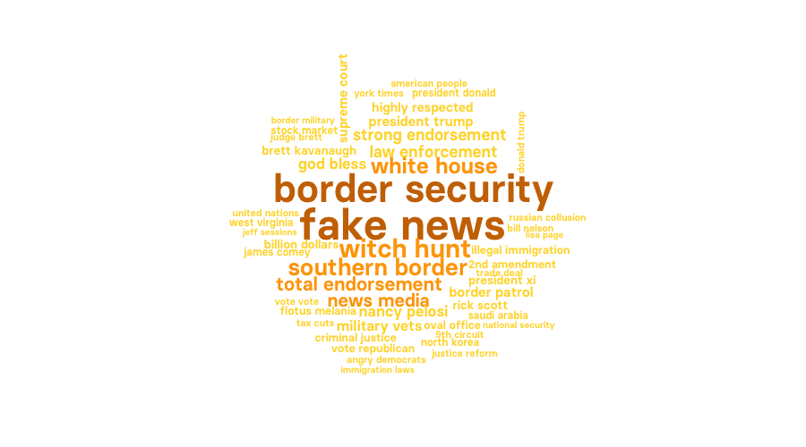
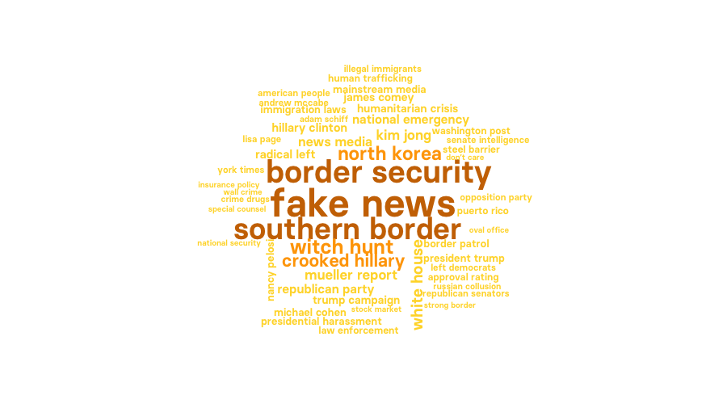
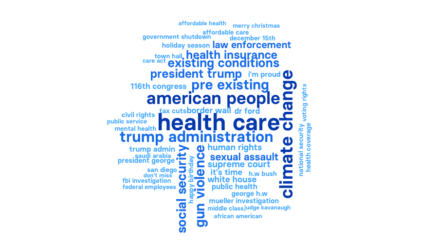
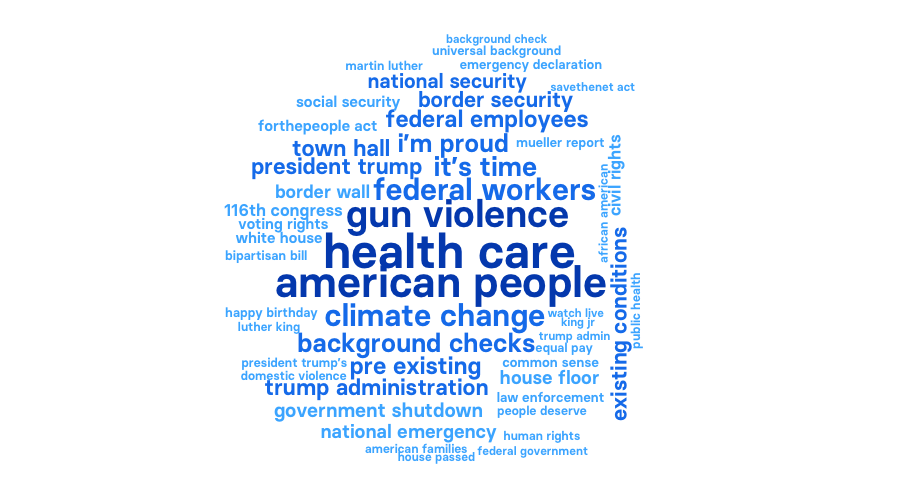
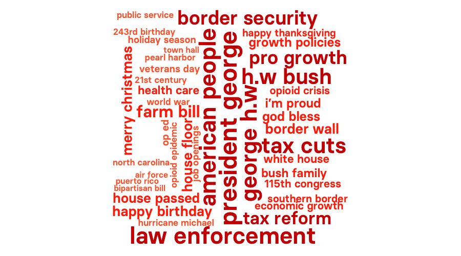
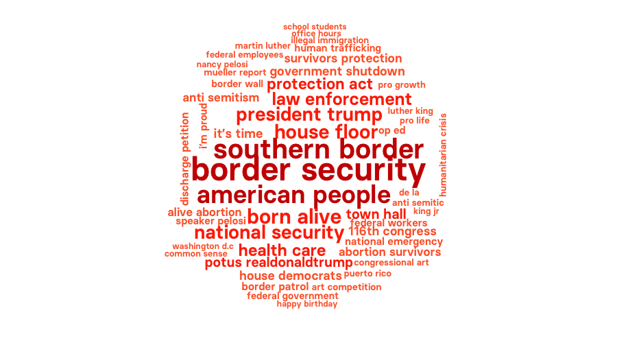
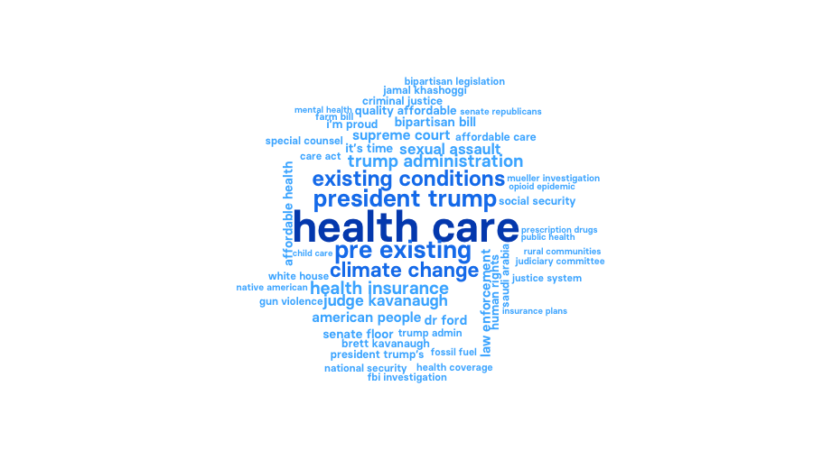
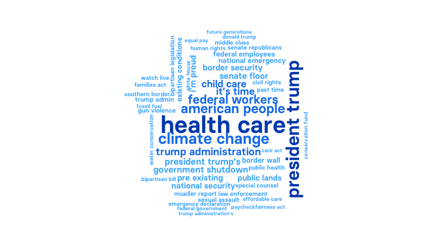
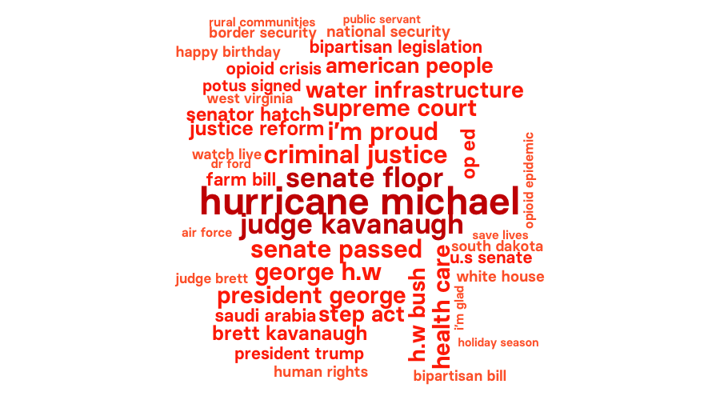
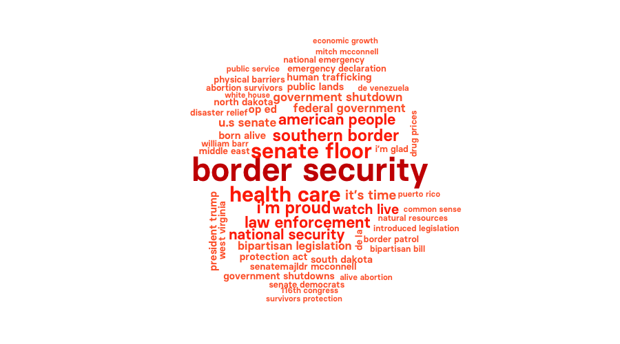

# 200 Days Of Political Twitter, Before And After The Start of The New Congress

```{r setup, include=FALSE}
library(knitr)
opts_chunk$set(out.width="900px", dpi=300)
```

Data and [R](https://www.r-project.org/) code for an analysis of political Twitter before and after the Democrats took control of the House of Representatives on Jan. 3, 2019. 

### Data

I gathered data on tweets from the official congressional accounts of all members of Congress for 100 days before and after the start of the 116th Congress on Jan. 3 2019. I also collected data for the same period on tweets from the campaign/personal accounts of freshman members who took their seat for the first time in the 116th Congress (including new Senators who previously sat in the House of Representatives), and for [President Donald Trump](https://twitter.com/realDonaldTrump). All data was gathered using the [rtweet](https://rtweet.info/) R package to access the [Twitter API](https://developer.twitter.com/en/docs/api-reference-index). I identified official congressional accounts from data maintained by [theunitedstates.io](https://theunitedstates.io/), which includes Twitter handles, and joined this to the tweets data to identify members by party. See this Jan 23, 2018 [BuzzFeed News story](https://www.buzzfeednews.com/article/peteraldhous/trump-twitter-wars) for an earlier analysis of how congressional Twitter responded to Trump in the first year of his presidency.

```{r, results="hide", warning=FALSE, message=FALSE}
# load required packages
library(tidytext)
library(dplyr)
library(tidyr)
library(purrr)
library(ggplot2)
library(stringr)
library(wordcloud)
library(DT)

# palette for Congressional Democrats and Republicans
party_pal <- c("#1482EE","#FF3300")

# palettes for wordclouds
dem_pal <- c("#47B5FF", "#1482EE", "#004FBB")
rep_pal <-  c("#FF6633", "#FF3300", "#CC0000")
trump_pal <-  c("#FFD833", "#FFA500", "#CC7200")

# regex for parsing tweets using the tidytext package
replace_reg <- "https?://[^\\s]+|&amp;|&lt;|&gt;|\\bRT\\b"
```

# Load and process data

The two Independent Senators, Bernie Sanders of Vermont and Angus King of Maine, caucus with the Democrats. So they were assigned as Democrats for this analysis.

```{r, results="hide", warning=FALSE, message=FALSE}
# load data
load("tweets.RData")
# make list of data frames
tweets <- list(members_tweets,campaign_freshmen_tweets,trump_tweets)

# remove separate data frames
rm(members_tweets,campaign_freshmen_tweets,trump_tweets)
gc()

# function to add variables to allow tweets to be plotted by week and before/after start of 116th Congress
process_tweets <- function(x) {
  x <- x %>%
    mutate(days = est_date - as.Date("2019-01-03"),
           weeks = round(days/7),
           congress = case_when(est_date >= "2019-01-03" ~ "new",
                             TRUE ~ "old"))
}

# apply function to the list
tweets <- map(tweets, process_tweets)

# assign Independent Senators to Democrats; change Sen. Sanders first name to Bernie
tweets[[1]]$party <- gsub("Independent","Democrat", tweets[[1]]$party)
tweets[[1]] <- tweets[[1]] %>%
  mutate(first_name = case_when(screen_name == "SenSanders" ~ "Bernie",
                                TRUE ~ first_name))

# add missing fields to Trump's tweets
tweets[[3]] <- tweets[[3]] %>%
  mutate(first_name = "Donald",
         last_name = "Trump",
         state = "NY",
         type = "pres",
         party = "Republican")
```

## Who had the most followers, who tweeted most often, and got the most retweets?

```{r, results="hide", warning=FALSE, message=FALSE}
# function to summarize each data frame for number of tweets and maximum followers for each account
summarize_tweets <- function(x) {
  x <- x %>%
    group_by(name = paste(first_name,last_name),party,type,state,screen_name) %>%
    summarize(tweets = n(), retweets = sum(retweet_count), followers = max(followers_count)) %>%
    mutate(avg_retweets = round(retweets/tweets)) %>%
    arrange(-followers)
}

# apply function to the list
summaries<- map(tweets, summarize_tweets)
```

### Official congressional accounts

```{r}
datatable(summaries[[1]], rownames = FALSE) %>% 
  formatCurrency(c("tweets","retweets","followers","avg_retweets"), currency = "", interval = 3, digits= 0, mark = ",")
```

### Freshmen campaign accounts

```{r}
datatable(summaries[[2]], rownames = FALSE) %>% 
  formatCurrency(c("tweets","retweets","followers","avg_retweets"), currency = "", interval = 3, digits= 0, mark = ",")
```

### Trump

```{r}
datatable(summaries[[3]], rownames = FALSE) %>% 
  formatCurrency(c("tweets","retweets","followers","avg_retweets"), currency = "", interval = 3, digits= 0, mark = ",")
```

### Tokenize tweets to words and bigrams

I tokenized original tweets only, excluding retweets.

```{r, results="hide", warning=FALSE, message=FALSE}
# function to tokenize to words
tokenize_to_words <- function(x) {
  x <- x %>%
    filter(is_retweet == FALSE) %>%
    mutate(text = str_replace_all(text, replace_reg, "")) %>%
    unnest_tokens(word, text, token = "tweets")
}

# apply function to the list
words <- map(tweets, tokenize_to_words)

# function to tokenize into bigrams
tokenize_to_bigrams <- function(x) {
  x <- x %>%
  filter(is_retweet == FALSE) %>%
  mutate(text = str_replace_all(text, replace_reg, "")) %>%
  unnest_tokens(bigram, text, token = "ngrams", n = 2) %>%
  separate(bigram, into = c("first","second"), sep = " ", remove = FALSE) %>%
  anti_join(stop_words, by = c("first" = "word")) %>%
  anti_join(stop_words, by = c("second" = "word")) %>%
  filter(str_detect(first, "[a-z]") &
         str_detect(second, "[a-z]"))
}

# apply function to the list
bigrams <- map(tweets, tokenize_to_bigrams)
```

## Taking the emotional temperature of Congress, week by week

I ran a sentiment on the original tweets, using the [lexicon](https://www.cs.uic.edu/~liub/FBS/sentiment-analysis.html) developed by [Bing Lui](https://www.cs.uic.edu/~liub/) of the University of Illinois at Chicago and colleagues. When matching words in the tweets to the lexicon’s list of words linked positive or negative emotions, I filtered out a set of custom stop words: “Trump,” classed as positive in this lexicon, plus “critical” and “issue(s),” classed as negative in this lexicon, but used differently by politicians. Values for negative words are shown as percentages of all positive and negative words. In my analysis of congressional Twitter during the first year of Trump's presidence, Democrats used consisently more negative language than Republicans. Has anything changed since the Democrats won control of the House?

```{r, results="hide", warning=FALSE, message=FALSE}
# load lexicon from https://www.cs.uic.edu/~liub/FBS/sentiment-analysis.html
bing <- get_sentiments("bing")

# custom stop words, to be removed from analysis. These are assigned as positive or negative in the lexicon, but have a different meaning in this context
custom_stop_words <- tibble(word = c("trump","critical","issues","issue"))

# join sentiments
sentiments <- words[[1]] %>%
  inner_join(bing, by = "word") %>%
  anti_join(custom_stop_words, by = "word")

# summarize data
sentiments_counts <- sentiments %>%
  group_by(party,type,weeks) %>%
  count(sentiment) %>%
  arrange(-n)

negative_freqs <- sentiments_counts %>%
  left_join(sentiments_counts %>% 
              group_by(party,type,weeks) %>% 
              summarise(total = sum(n))) %>%
  mutate(percent = round(n/total*100,2)) %>%
  filter(sentiment == "negative") %>%
  ungroup() %>%
  mutate(type = case_when(type == "rep" ~ "House",
                          TRUE ~ "Senate"))

# chart
ggplot(negative_freqs, aes(x = weeks,y = percent,color = party)) +
  geom_point() +
  geom_line() +
  facet_wrap(~type, ncol = 1) +
  geom_vline(xintercept = 0, size = 0.5, linetype = "dotted") +
  scale_color_manual(values = party_pal, name = "") +
  theme_minimal(base_size = 16, base_family = "BasierSquare-SemiBold") +
  theme(legend.position = "top") +
  ylab("% negative words") +
  xlab("Weeks before/after start of new Congress")
```

While the overall difference in the sentiment of tweets between the parties in the Senate has remained more or less the same, the sentiments of the two parties in the House has converged since the Democrats took control.

## New members' use of campaign and official congressional accounts

```{r, results="hide", warning=FALSE, message=FALSE}
campaign_freshmen <- tweets[[2]] %>%
  group_by(first_name, last_name, screen_name, party, state, type, congress) %>%
  count() %>%
  spread(congress,n) %>%
  mutate(change = round((new-old)/old*100))

official_freshmen <- tweets[[1]] %>%
  semi_join(campaign_freshmen, by = c("last_name","party","type","state")) %>%
  filter(congress == "new") %>%
  group_by(first_name, last_name, screen_name, party, state, type, congress) %>%
  summarize(official_tweets = n())
  
freshmen <- inner_join(campaign_freshmen,official_freshmen, by = c("last_name","party","type","state")) %>%
  mutate(name = paste(first_name.x,last_name),
         ratio = round(new/official_tweets,1)) %>%
  ungroup() %>%
  select(14,4:6,3,8,7,9,11,13,15) %>%
  mutate(type = case_when(type == "rep" ~ "House",
                          TRUE ~ "Senate"))
```

### Members who tweeted more from their campaign accounts than their official ones after the start of the new Congress

Members of Congress are not allowed to link to their congressional offices from the campaign accounts. So they typically set up official congressional accounts which they then use more frequently. But some of the new intake, and one member in particular, have bucked that trend.

Recently described by my colleague Lam Thuy Vo as the "[brightest political star born fully of the social media age](https://www.buzzfeednews.com/article/lamvo/alexandria-ocasio-cortez-aoc-conservatives-liberals-meme)," Alexandria Ocasio-Cortez has carried on tweeting prolifically from her campaign account, matching Trump tweet for tweet. But her official account tweeted just 17 times in the first 100 days of the new Congress.

```{r, results="hide", warning=FALSE, message=FALSE}
ggplot(subset(freshmen, ratio > 1), aes(x=reorder(name,ratio), y=ratio, fill=party)) +
  geom_col(color = "white") +
  coord_flip() +
  scale_fill_manual(values = party_pal, name = "") +
  theme_minimal(base_size = 16, base_family = "BasierSquare-SemiBold") +
  theme(legend.position = "top") +
  ylab("Ratio of campaign to official tweets") +
  xlab("") +
  theme(panel.grid.major.y = element_blank(),
        panel.grid.minor.y = element_blank())
```

### Members who tweeted more from their campaign accounts after the start of the new Congress

The chart below shows the few members of the new intake who increased their output of tweets from their campaign accounts in the 100 days after taking their seats, compared to the previous 100 days. 

```{r, results="hide", warning=FALSE, message=FALSE}
ggplot(subset(freshmen, change > 0), aes(x=reorder(name,change), y=change, fill=party)) +
  geom_col(color = "white") +
  coord_flip() +
  scale_fill_manual(values = party_pal, name = "") +
  theme_minimal(base_size = 16, base_family = "BasierSquare-SemiBold") +
  theme(legend.position = "top") +
  ylab("% increase in campaign account tweets") +
  xlab("") +
  theme(panel.grid.major.y = element_blank(),
        panel.grid.minor.y = element_blank())
```

### What has AOC been saying before and after taking her seat?

Again, this code generates bigrams from original tweets, after removing commonly used stop words.

```{r, results="hide", warning=FALSE, message=FALSE}
aoc_bigrams <- bigrams[[2]] %>%
  filter(screen_name == "AOC") %>%
  group_by(bigram,congress) %>%
  count() %>%
  ungroup()
  
for (c in c("old","new")) {
  tmp <- aoc_bigrams %>%
    filter(congress == c)
  png(paste0("wordclouds/bigrams_",c,"_AOC.png"), width = 900, height = 500)
  try(wordcloud(tmp$bigram,
                tmp$n,
                family = "BasierSquare-SemiBold",
                max.words = 50,random.order = FALSE,
                colors = dem_pal))
  dev.off()
}

```
#### Old Congress


#### New Congress


AOC's tweets have a strong focus on climate change. After taking her seat, she was not appointed to the new House Select Committee on the Climate Crisis. Her mentions of the committee have fallen away since, but climate change remains front and center. 

### What has Trump been saying before and after the start of the new Congress?

```{r, results="hide", warning=FALSE, message=FALSE}
trump_bigrams <- bigrams[[3]] %>%
  group_by(bigram,congress) %>%
  count() %>%
  ungroup()
  
for (c in c("old","new")) {
  tmp <- trump_bigrams %>%
    filter(congress == c)
  png(paste0("wordclouds/bigrams_",c,"_trump.png"), width = 900, height = 500)
  try(wordcloud(tmp$bigram,
                tmp$n,
                family = "BasierSquare-SemiBold",
                max.words = 50,random.order = FALSE,
                colors = trump_pal))
  dev.off()
}
```

#### Old Congress



#### New Congress



Trump's obsessions -- attacking the media and the southern border -- have been consistent. With Democrats in control of the House, refusing to pass extra funding for his border wall, he declared a  contested national emergency in an attempt to divert military funding to the project.

## And what have members of Congress been saying before and after the start of the new Congress?

This code generates bigram clouds for each combination of party, chamber, and new vs. old Congress from original tweet from official congressional accounts, excluding retweets, and saves them in the `wordcloud` folder. 

```{r, results="hide", warning=FALSE, message=FALSE}
members_bigrams <- bigrams[[1]] %>%
  group_by(bigram,party,type,congress) %>%
  count() %>%
  ungroup() %>%
  mutate(type = case_when(type == "rep" ~ "House",
                          TRUE ~ "Senate"))
  
for (p in c("Democrat","Republican")) {
  for (c in c("old","new")) {
    for (t in c("Senate","House")) {
      tmp <- members_bigrams %>%
        filter(party == p & type == t & congress == c)
      png(paste0("wordclouds/bigrams_",p,"_",c,"_",t,".png"), width = 900, height = 500)
      try(wordcloud(tmp$bigram,
            tmp$n,
            family = "BasierSquare-SemiBold",
            max.words = 50,random.order = FALSE,
            colors = case_when(p == "Democrat" ~ dem_pal,
                               TRUE ~ rep_pal)))
      dev.off()
    }
  }
}
```
### House Democrats

#### Old Congress



#### New Congress



### House Republicans

#### Old Congress



#### New Congress



### Senate Democrats


#### Old Congress




#### New Congress



### Senate Republicans

#### Old Congress



#### New Congress



After the Democrats took control of the House, the most notable change is that Republican congressional Twitter swung behind Trump's rhetoric on security at the southern border.


